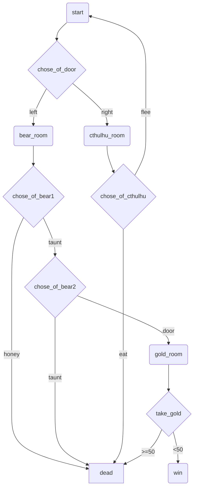

```mermaid
graph TD
	A(start) --> B{chose_of_door}
	B -->|left| C(bear_room)
	B -->|right| D(cthulhu_room)
	C --> E{chose_of_bear1}
	E -->|honey| F[dead]
	E -->|taunt| G{chose_of_bear2}
	G -->|taunt| F
	G -->|door| H(gold_room)
	D --> I{chose_of_cthulhu}
	I -->|eat| F
	I -->|flee| A
	H --> J{take_gold}
	J -->|>=50| F
	J -->|<50| K(win)
	
```